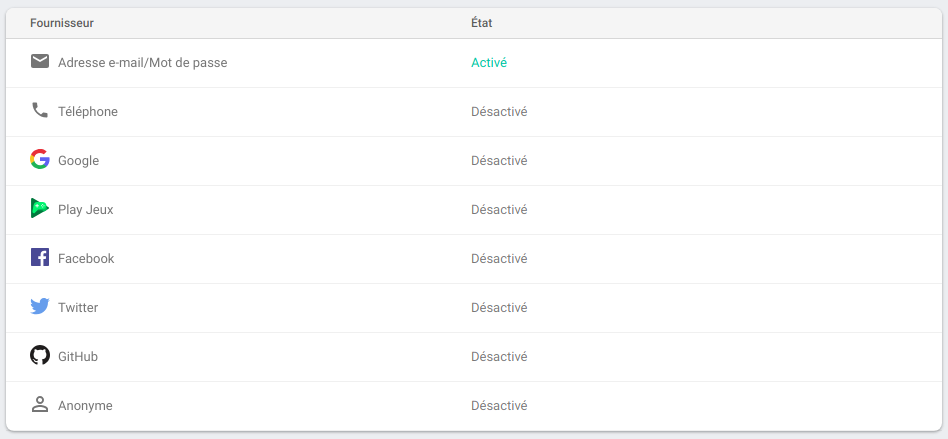

# Premier Exercice sur Firebase (Authentification)

## Les différents mode de connexion

Il existe différent mode de connexion que peut utiliser Firebase. Il suffit pour la plupart de les activer, d'autres requierts plus d'attention, genre des options a régler. (Ex : Google, Facebook)

  - Adresse e-mail/Mot de passe
  - Téléphone
  - Google
  - Play Jeux
  - Facebook
  - Twitter
  - GitHub
  - Anonyme

  Dans ce Workshop, nous allons voir les trois plus utilisé : 
  - Adresse e-mail/Mot de passe
  - Google
  - Facebook

## Authentification avec Email & Password

Pour commencer, allons dans Authentification (menu Firebase) puis dans mode de connexion. Cliquez sur "Adresse e-mail/Mot de passe" et activer le premier.
Le deuxième ne nous intèresse pas pour cette exercice, mais n'hésitez pas, par après a aller voir ce que c'est. Puis cliquez sur Enregistrer.

N'activez pas maintenant Google et Facebook, vous allez devoir tout remplir et la première fois ce n'est pas facile. On le fera ensemble.

## Création d'un utilisateur

Créons un utilisateur maintenant pour pouvoir se connecter. 

      E-mail : user@sky.net
      Mot de passe : azerty

Voici l'utilisateur que j'ai créer.

Maintenant le but est de se connecter avec cette utilisateur.

## Login

Avant toute chose, n'oubliez pas de rajouter le module Authentification dans votre fichier de config. Je vous laisse chercher comment faire. Aidez vous de la documentation et Google.

## Table des matières

  - [Intro](intro.md) 
  - **Realtime Database**
    - [Créer et afficher notre DB](./Realtime_Database/exercice01.md)
    - [Modifier et supprimer de la data de notre DB](./Realtime_Database/exercice02.md)
  - **Authentification**
    - [Premier Exercice](./Authentification/exercice01.md)
    - [Deuxième Exercice](./Authentification/exercice02.md)
  - **Cloud Firestore**
    - [Créer et afficher notre DB](./Cloud_Firestore/exercice01.md)
    - [Modifier et supprimer de la data de notre DB](./Cloud_Firestore/exercice02.md)
  - **Storage**
    - [Premier Exercice](./Storage/exercice01.md)
    - [Deuxième Exercice](./Storage/exercice02.md)
