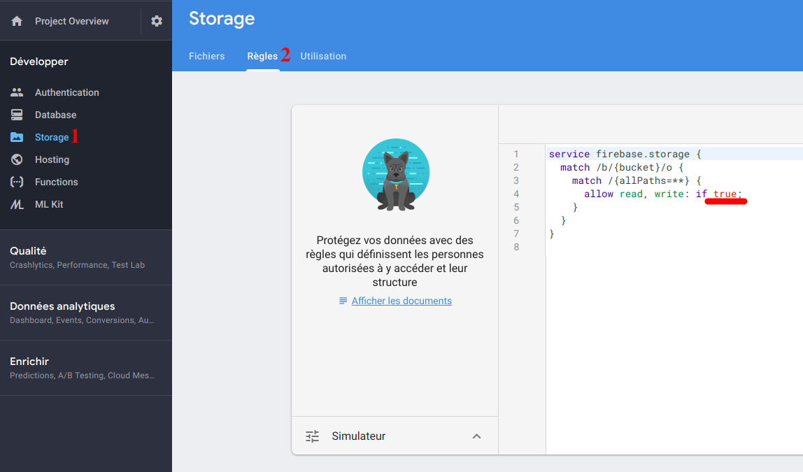

# STORAGE

## C'est quoi ?
Le composant **Storage** permet d'upload des images, vidéos sur Firebase. Il peut être complémentaire à RealTime Database/Cloud Firestore. Si vous voulez en savoir plus, <a href="https://firebase.google.com/docs/storage/" target="_blank">cliquez ici</a>

## Préparation

Pour commencer, allez sur Firebase, Storage et Règles.
Ensuite il ne vous reste plus qu'à changer les règles comme sur l'image ci-dessous.

Ah oui faudrait peut-être que je vous explique pourquoi on change les règles. Alors c'est parce que normalement on doit les faire nous-même, pour qu'on puisse pas rajouter sans être connecté ou sous une certaine condition. Là si c'était pour mettre en ligne par après, on se ferait piraté en deux secondes.
Si on a le temps on verra comment faire de bonne règles, sinon rien ne vous empêche d'aller voir cela par vous-même quand vous avez le temps.

Une fois cela fait, passons à l'exercice.

## Exercice

Utiliser Storage tout simplement est simple en lui-même. Du coup je l'ai un peu corsé.

Comme vous pouvez le voir sur le html, il y a une barre de progress, du coup, quand vous mettez une image en cliquant sur "*Choisir un fichier*", déjà il doit rejoindre le Storage de la DB puis la barre de progress doit avancer par rapport à l'upload de l'image (En pur JavaScript).

C'est tout, après on aurait pu encore plus le compliquer, lier le Storage à RealTime Database, genre mettre une image pour nos données des Voisins et nous-même. Vous pouvez toujours le faire une autre fois.

## Table des matières

  - [Intro](../intro.md) 
  - **Realtime Database**
    - [Créer et afficher notre DB](../1_Realtime_Database/exercice01.md)_
    - [Modifier et supprimer de la data de notre DB](../1_Realtime_Database/exercice02.md)
  - **Storage**
    - [Utiliser le composant Storage](./exercice01.md)
  - **Authentification**
    - [Authentification avec Email & Password](../3_Authentification/exercice01.md)