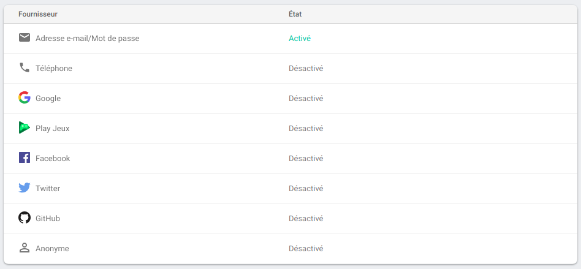

# Premier Exercice sur Firebase (Authentification)

## Les différents mode de connexion

Il existe différents modes de connexion que peut utiliser Firebase. Il suffit pour la plupart de les activer, d'autres requierts plus d'attention, genre des options à régler. (Ex : Google, Facebook)

  - Adresse e-mail/Mot de passe
  - Téléphone
  - Google
  - Play Jeux
  - Facebook
  - Twitter
  - GitHub
  - Anonyme

  Dans ce Workshop, nous allons voir : 
  - Adresse e-mail/Mot de passe
  - Google
  - Facebook
  - GitHub

## Authentification avec Email & Password

Pour commencer, allez dans Authentification (menu Firebase) puis dans mode de connexion. Cliquez sur "Adresse e-mail/Mot de passe" et activez le premier.
Le deuxième ne nous intèresse pas pour cet exercice, mais n'hésitez pas, par après à aller voir ce que c'est. Puis cliquez sur Enregistrer.

N'activez pas maintenant Google et Facebook, vous allez devoir tout remplir et la première fois ce n'est pas facile. On le fera ensemble.

## Création d'un utilisateur

Créons un utilisateur maintenant pour pouvoir se connecter. 

      E-mail : user@sky.net
      Mot de passe : azerty

Voici l'utilisateur que j'ai créé.

Maintenant le but est de se connecter avec cet utilisateur.

## Login

Avant toute chose, n'oubliez pas de rajouter le composant Authentification dans votre fichier de config. Je vous laisse chercher comment faire. Aidez-vous de la documentation et Google.

Ensuite prenez le fichier index.html qui se trouve dans le dossier Authentification. Il ne vous reste plus qu'à faire le JavaScript.

##### Maintenant voici ce qu'on souhaite avoir en premier lieu.
Quand vous vous connectez avec l'user que vous avez créé plus haut, dans la console, il doit y avoir un message "You're Sign Up" pour confirmer votre connexion, ensuite le bouton Log Out doit s'afficher et le bouton Log In disparaitre. Vice versa pour quand vous vous deconnectez, le bouton Log Out doit disparaitre et le bouton Log In s'afficher

Par après, si vous remplissez un email "CORRECT", un password (qui doit s'afficher par des *** quand vous l'écrivez) et que vous cliquez sur Sign Up, il doit rejoindre la liste des users (Authentification)

N'hésitez pas à aller voir la documentation sur Firebase.

Maintenant nous allons faire pareil **mais** avec Google, Facebook et GitHub. Accrochez-vous !

## Table des matières

  - [Intro](../intro.md) 
  - **Realtime Database**
    - [Créer et afficher notre DB](../1_Realtime_Database/exercice01.md)_
    - [Modifier et supprimer de la data de notre DB](../1_Realtime_Database/exercice02.md)
  - **Storage**
    - [Utiliser le composant Storage](../2_Storage/exercice01.md)
  - **Authentification**
    - [Authentification avec Email & Password](./exercice01.md)
    - [Authentification avec Google, Facebook et GitHub](./exercice02.md)