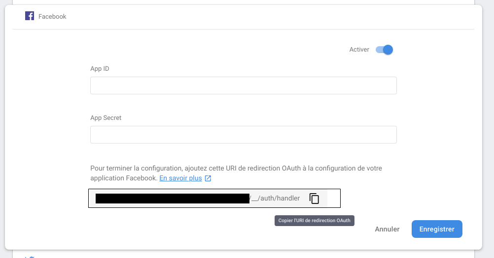
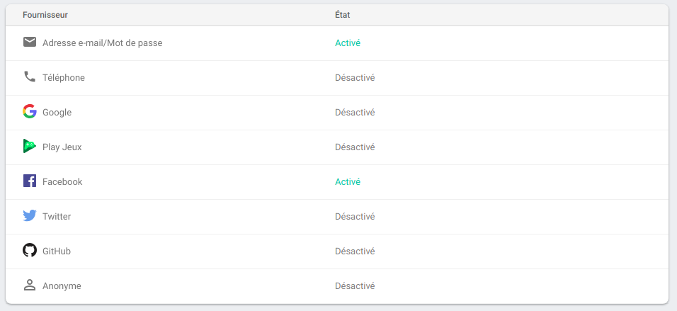

# Deuxième Exercice sur Firebase (Authentification)

## Authentification avec Facebook

#### Préparation
Tout comme pour Email et Mot de passe, nous devons aller l'activer mais pas que <span style="color:blue">:smile:</span>.

#### Developers Facebook
Allez sur <a href="https://developers.facebook.com/" target="_blank">Developers Facebook</a> puis connectez-vous avec votre compte Facebook, si vous n'en avez pas, créez en un vite fait. On peut aussi utiliser un compte Facebook pour autre chose que raconter sa vie sur le reseau social. Genre pour nous developper.

Allez maintenant dans "Mes applications"("My Apps" in English), puis "Ajouter une application" ("Add a New App"), il ne vous reste plus qu'à donner un nom à votre App (exemple "prénom-nom-workshop").

Nous avons besoin de "Facebook Login", passez la souris dessus et sélectionnez "Configurer", puis sélectionnez "Web" comme plate-forme souhaitée. Ensuite, donnez-lui l'URL du site (genre avec le localhost, faudra juste tout mettre dans votre Lamp(Linux), Wamp, etc ...) et cliquez sur "Enregistrer", puis sur "Paramètres", sous "Connexion Facebook" (menu de gauche).



> PS : C'est le machin encadrer en noir. Copiez le vôtre, également. :grin:

Copiez le lien dans le input de "URI de redirection OAuth valides" puis enregistrez.

Ensuite allez dans le "Tableau de bord", copiez l'ID de l’APP et mettez le dans "App ID" de Firebase, maintenant il nous reste à trouver "App Secret". Vous allez dans "Paramètres" sur **Developers Facebook**, puis "Général". 
La "Clé secrète" se trouve en haut à droite, cliquez sur afficher, il va vous demander votre mot de passe, puis vous n'avez plus qu'à la copier/coller au bon endroit dans Firebase. Enregistrez et c'est terminé pour la configuration.



Maintenant il ne vous reste plus qu'à faire la connexion.

Liez-le au bouton déjà fait sur l'html.
Bon courage, le plus laborieux est fait.


## Authentification avec Google
Concernant la connexion avec Google, je vous laisse chercher. Nous avons fait Facebook, qui est bien plus compliqué.
Bon courage.


## Authentification avec GitHub
Pour la connexion avec GitHub, je vous laisse également chercher comment faire, cela ressemble un peu a Facebook.
Bon courage.


## Règles
Vous vous rappelez que je vous ai parlé des règles dans le Storage. Ici on va justement y toucher un petit peu.

Normalement vos règles de votre RealTime Database sont comme ci-dessous, sinon vous avez pas tout suivi.

```javascript
{
  "rules": {
    ".read": true,
    ".write": true
  }
}
```

Maintenant mettez vos règles de cette façon.

```javascript
{
  "rules": {
    ".read": "auth != null",
    ".write": "auth != null"
  }
}
```

Si vous avez compris, parfait, sinon c'est simple, il vous empêche de lire/écrire les données tant que vous n'êtes pas connecté.

> Tant que auth est différent de null

Voilà qui conclu le composant Authentification.
Envie de continuer ?

Passons alors à Cloud Firestore. 


## Table des matières

  - [Intro](../intro.md) 
  - **Realtime Database**
    - [Créer et afficher notre DB](../1_Realtime_Database/exercice01.md)_
    - [Modifier et supprimer de la data de notre DB](../1_Realtime_Database/exercice02.md)
  - **Storage**
    - [Utiliser le composant Storage](../2_Storage/exercice01.md)
  - **Authentification**
    - [Authentification avec Email & Password](./exercice01.md)
    - [Authentification avec Google, Facebook et GitHub](./exercice01.md)
  - **Cloud Firestore**
    - A suivre dans l'épisode DEUX ! (sinon revenez un jour sur le repo)
